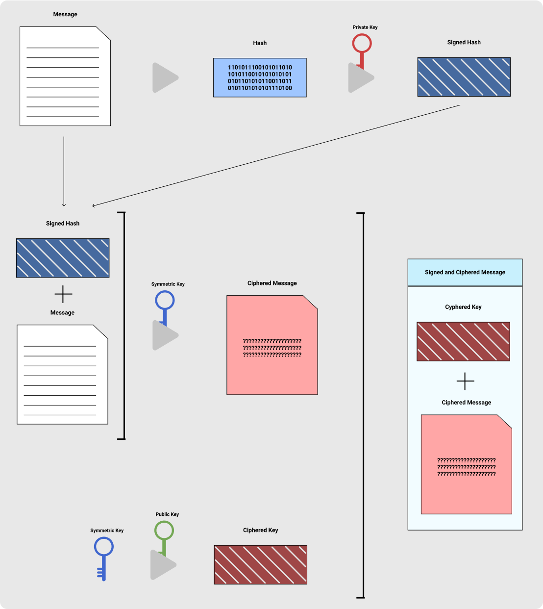
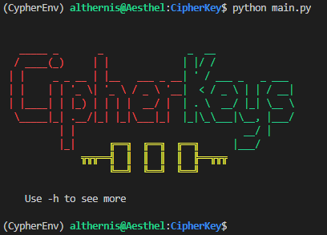
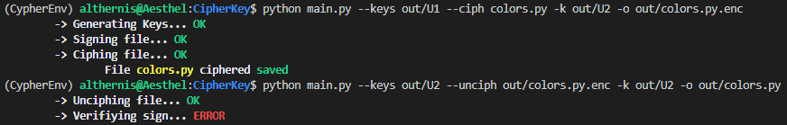

<p align="center">
    <br>
    
    <br>

</p>

# Program Structure

## Sign and Cipher

We start with a Message contained in a file.

First, we have to sign it. For that, we have to use a hash function with the messages's text. Once we have it, we use our private key (RSA pair keys) to cipher it, having the sign.

With the signed hash and the message its neccesary to generate a symmetric key, using AES. Using that key, we cipher the concatenation of the signed hash and the message, obtaining the cipher message.


In order to communicate the Symmetric key with the destination, we have to cipher the symmetric key with the destination's public asymmetric key, so the destination could uncipher it with their private key.

The singed and cipher message will be the concatenation of the ciphered Symmetric key with the ciphered message.

Here is the resultant diagram:

<p align="center">
    <br>
    
    <br>
   <br>
   Sign and Cipher a Message
</p>

## UnCipher and Check Sign

We start with a Singed and Chipered Message contained in a file.

We have to read it and get the Symmetric key, unciphing it using the user's private key and getting the sign and content.

Its necessary to validate the sign and, if its ok, get the content.

## Functions

- **generate_RSA**: Generate the keys

- **load_RSA**: Load/Generate the keys

- **sign**: Sign the content

- **check_sign**: Check the sign

- **cipher**: Ciph content

- **unciph**: Unciph content

- **sign_and_ciph**: Sign and Ciph a file

- **unciph_file**: Unciph content

- **unciph_aes_key**: Unciph AES Key

- **unciph_and_checkSign**: Unciph file and check the Sign

# Enviroment
This enviroment is created using virtualenv on a linux machine.

```sh

virtualenv -p python3 CypherEnv

source CypherEnv/bin/activate

pip install PyCryptodome
```

**!important dont install PyCrypto. There are some conflicts.**

## Examples

This examples were run on a linux machine. If you use Windows, the output could change due to the [colors.py](colors.py) module.

### No parameters

<p align="center">
    <br>
    
    <br>
   <br>
   Verbose mode
</p>

### Keys Generation, Ciph and Error

<p align="center">
    <br>
    
    <br>
   <br>
</p>